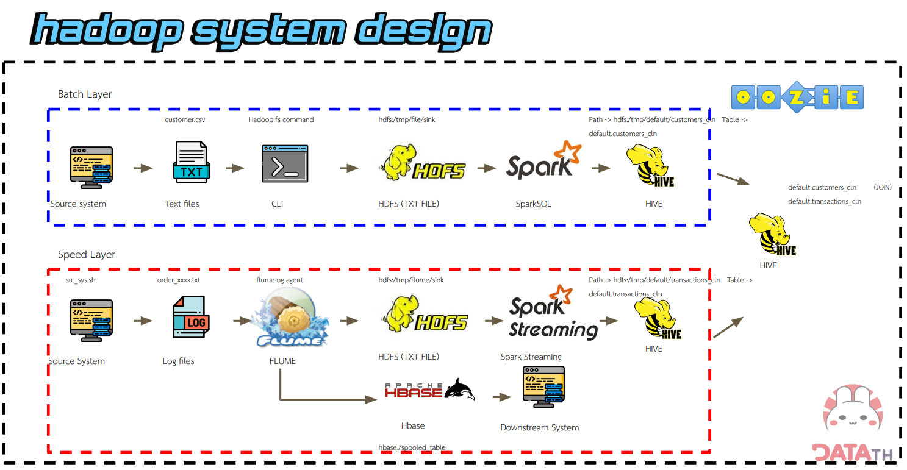

# Coffee shop data pipeline with hadoop

## Overview

This project is part of the **Road to Data Engineer Special Live**. The goal of this project is to create a pipeline from both CSV file data and streaming data to make the data suitable for calculating membership points, which can be used to create promotions or sales.


The diagram depicts a Hadoop system architecture designed for handling both batch and real-time data processing. It outlines two primary layers:

- **Batch Layer**: Processes large volumes of historical data in batches for analysis and reporting.
- **Speed Layer**: Handles real-time data streams for immediate insights and updates.

## Batch Layer Workflow

### Data Ingestion

- **Source System**: Text files are generated in form of csv.
- **CLI**: The Hadoop command-line interface (CLI) is used to interact with the system.
- **HDFS**: Text files is stored in the Hadoop Distributed File System (HDFS).

### Data Processing

- **SparkSQL**: Data is loaded into SparkSQL for data cleansing.
- **HIVE**: Data is transformed and queried using Hive which is a data warehousing infrastructure built on top of Hadoop.

### Output

- **Tables**: Processed data is stored in Hive tables for further analysis or reporting.

## Speed Layer Workflow

### Data Ingestion

- **Source System**: Log files are generated from a source system.
- **Flume**: Flume is used to collect, aggregate, and move log data into the Hadoop ecosystem.
- **HDFS**: Log data is stored in HDFS.
- **HBASE**: Data is stored in HBase, a NoSQL database optimized for fast read/write operations.

### Data Processing

- **Spark Streaming**: Real-time data is processed using Spark Streaming.
- **HIVE**: Data is transformed and queried using Hive.

### Output

- **Tables**: Processed data is stored in Hive tables for further analysis or reporting.
  
## Automated workflow with oozie
- Join two tables from Batch Layer Workflow and Speed Layer Workflow together to make a table that suitable for calculating membership points.
- Created and saved new table for each day by running workflows daily.
  
## Key Components

- **HDFS**: Provides distributed storage for both batch and real-time data.
- **Spark**: A unified analytics engine for batch and streaming data processing.
- **Hive**: A data warehousing infrastructure built on top of Hadoop for SQL-like queries.
- **Flume**: A distributed, fault-tolerant, and available system for efficiently collecting, aggregating, and moving large amounts of log data.
- **HBASE**: A NoSQL database optimized for fast read/write access, suitable for real-time applications.

- **OOZIE**: A Workflow Scheduler/Orchestrator tool.
## Requirements
- Set-up Google Compute Engine 
1. **Machine configuration : n2-standard-4(4vCPU, 16GB memory)**
2. **Boot disk : Ubuntu 20.04 LTS, size 40GB**
3. **Allow HTTP,HTTPS traffic**
- Set-up firewall rule
1. **Allow on match : Allow**
2. **Source filter : IPv4 ranges**
3. **Source IPv4 ranges : 0.0.0.0/0**
4. **Protocols and ports : specified > tcp > 7180,8888**
- Install docker on Ubuntu
  [Here!](https://www.digitalocean.com/community/tutorials/how-to-install-and-use-docker-on-ubuntu-20-04)
- Run code
1.
```bash
docker pull mikelemikelo/cloudera-spark:latest
```
2.
```bash
docker run --hostname=quickstart.cloudera --privileged=true -it -p 8888:8888 -p 8080:8080 -p 7180:7180 -p 88:88/udp -p 88:88 mikelemikelo/cloudera-spark:latest /usr/bin/docker-quickstart-light
```
3.
```bash
sudo /home/cloudera/cloudera-manager --express && service ntpd start
```
- Run cloudera and HUE using VM external ip
- Add flume in HUE
- copy file from this repo to docker container that run hadoop services

  


